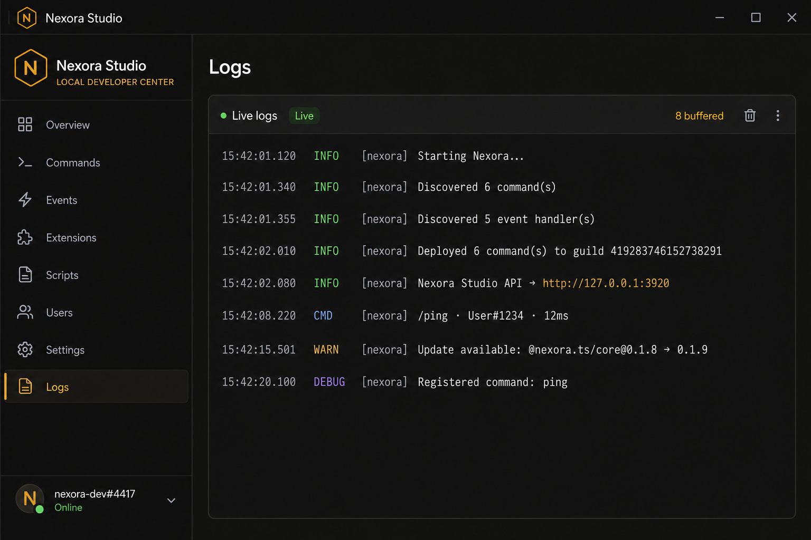
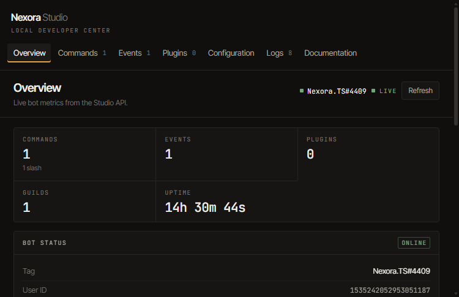
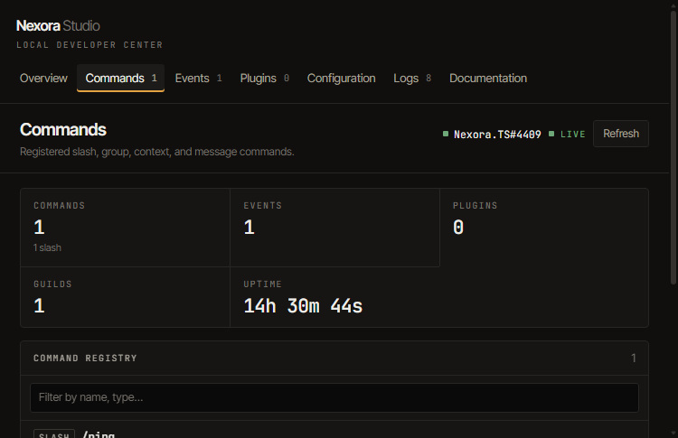
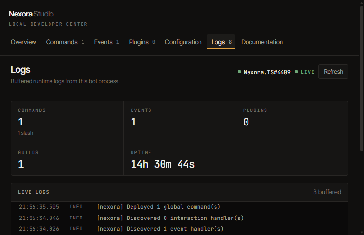
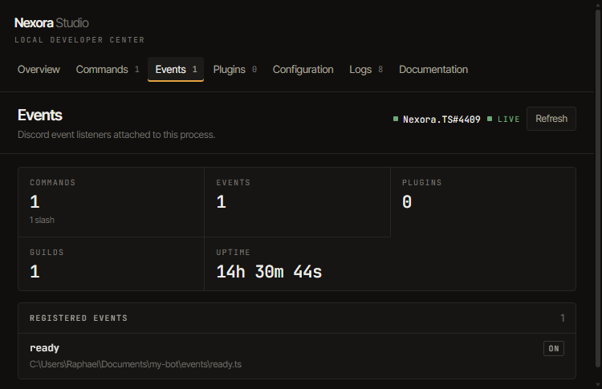
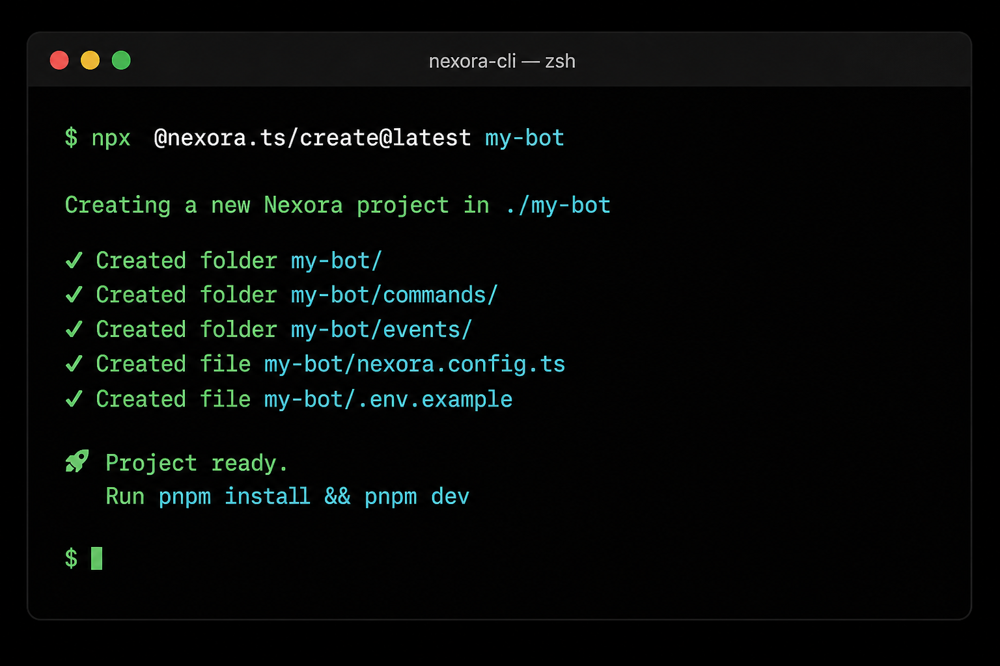

# GitHub Release draft — Nexora `v0.1.9`

Paste into **GitHub → Releases → Draft a new release**.

---

## Tag suggestion

| Field | Value |
| --- | --- |
| **Tag** | `v0.1.9` |
| **Target** | `main` (commit you just pushed) |
| **Why this tag** | Aligns with published npm package versions (`@nexora.ts/core@0.1.9`, `@nexora.ts/create@0.1.9`, and sibling `@nexora.ts/*` packages in the `0.1.x` line). |

> Optional alternate: `v0.1.0` only if you want a “first GitHub release” number that differs from npm — **not recommended** once `0.1.9` is already on the registry.

---

## Title (GitHub “Release title”)

```text
Nexora v0.1.9 — The platform that revolutionizes Discord bot development
```

Catchy alternates (pick one):

```text
Nexora 0.1 — Stop scaffolding. Start shipping Discord bots.
```

```text
Introducing Nexora: CLI + Studio + plugins for Discord bots that feel production-ready
```

---

## Write (GitHub release body)

Copy everything below the line into the **Write** tab.

---

### Summary

**Nexora is out in public preview (`v0.1.9`).**

Nexora is the open-source TypeScript platform that **revolutionizes how Discord bots are built** — not another throwaway starter, but a coherent stack: project CLI, auto-discovery, plugins, structured logging, and **Nexora Studio** (your local Developer Center) so you go from idea to a running bot in minutes.

This release marks the first public GitHub Release for the framework. APIs may still change before `1.0.0` — treat `0.1` as an early preview built for real experiments and community feedback.

### Highlights

- **CLI** — `npx @nexora.ts/create@latest` scaffolds a full bot project (config, commands, events, Studio wiring).
- **Nexora Studio** — local Developer Center on `http://localhost:3002` with live Overview, Commands, Events, Plugins, Logs, and more.
- **Plugins** — first-class extension surface for commands, events, API, and services without forking core.
- **Auto-discovery** — drop `command()` / `event()` files into folders; Nexora finds and registers them.
- **Logging** — structured logger + startup banner so runtime behavior is inspectable from day one.
- **Docs** — GitBook guide for the platform and Studio workflow.

<p align="center">
  
</p>

<p align="center">
  
</p>

<p align="center">
  
</p>

<details>
<summary>Live captures from a running bot (Studio on :3002)</summary>

<p align="center">
  
</p>

<p align="center">
  
</p>

<p align="center">
  
</p>

<p align="center">
  
</p>

</details>

<p align="center">
  
</p>

### What’s included (npm packages)

| Package | Role |
| --- | --- |
| `@nexora.ts/create` | Project CLI / scaffold (`npx @nexora.ts/create`) |
| `@nexora.ts/core` | Bot runtime, commands, events, DI |
| `@nexora.ts/config` | Type-safe `defineConfig()` |
| `@nexora.ts/logger` | Structured logging |
| `@nexora.ts/plugin-system` | Plugin API & lifecycle |
| `@nexora.ts/dev-server` | Studio introspection API + embedded UI |
| `@nexora.ts/database` | Drizzle + repositories |
| `@nexora.ts/auth` | Discord OAuth & permissions |
| `@nexora.ts/api` | Internal REST API |
| `@nexora.ts/websocket` | Live events |

**Not published (on purpose):** `apps/*` (docs, Studio app, playground, dashboard) and `@nexora.ts/ui` (internal).

### Getting started

```bash
npx @nexora.ts/create@latest my-bot
cd my-bot
pnpm install
cp .env.example .env   # add DISCORD_TOKEN + DISCORD_CLIENT_ID
pnpm dev
```

Open **http://localhost:3002** for Nexora Studio.

Minimal command:

```ts
import { command } from '@nexora.ts/core';

export default command({
  name: 'ping',
  description: 'Ping command',
  execute(ctx) {
    return ctx.interaction.reply('Pong!');
  },
});
```

### Known limitations (0.1 preview)

- APIs may change before `1.0.0` — pin versions in production experiments.
- Plugin install CLI (`nexora add <plugin>`) is still on the roadmap.
- Official example plugins (tickets, moderation, …) are planned, not bundled yet.
- Some Studio surfaces (e.g. Pipelines / advanced inspectors) depend on the Studio build embedded with your `@nexora.ts/dev-server` version — upgrade packages together.
- Database / auth / dashboard stacks are available but optional; SQLite/Postgres probe status depends on your project config.

### Discord `/ping` reply screenshot

> **Not included in this draft.** A usable `DISCORD_TOKEN` exists in a local `my-bot` project and Studio shows `/ping` registered + the bot **LIVE**, but Discord chat UI screenshots could not be captured from this environment (no Discord client / browser Discord session automation).  
> **Please add manually:** run the bot → `/ping` in a guild channel → attach the Pong reply image to this Release as `discord-ping-pong.png`.

### Links

- **Docs (GitBook):** https://cjays-organization.gitbook.io/nexora.ts  
- **Studio guide:** https://cjays-organization.gitbook.io/nexora.ts/platform/nexora-studio  
- **Repository:** https://github.com/ogcjay/nexorajs  
- **npm (core):** https://www.npmjs.com/package/@nexora.ts/core  
- **npm (create):** https://www.npmjs.com/package/@nexora.ts/create  
- **Contributing:** [CONTRIBUTING.md](../CONTRIBUTING.md)  
- **License:** MIT

---

## Assets (optional GitHub “Attach binaries”)

Upload files from `.github/release-assets/` when creating the Release (images won’t render from relative paths until they are either committed on `main` and linked via raw/GitHub blob URLs, or attached and then referenced by their release download URLs).

**Recommended attach list**

| File | Use |
| --- | --- |
| `studio-overview.png` | Hero / Preview |
| `studio-commands.png` | Commands highlight |
| `studio-logs.png` | Logs highlight |
| `studio-plugins.png` | Plugins highlight |
| `studio-overview-live.png` | Live Overview proof |
| `studio-commands-live.png` | Live `/ping` registry |
| `studio-logs-live.png` | Live logs |
| `studio-events-live.png` | Event inspector |
| `cli-scaffold.png` | CLI |
| `startup-banner.png` / `logger-console.png` | Logging |
| `social-preview.png` | Also set under **Repo → Settings → Social preview** if not already |

After upload, you can rewrite image `src` to:

`https://github.com/ogcjay/nexorajs/releases/download/v0.1.9/<filename>`

Or rely on paths under `main` once committed:

`https://raw.githubusercontent.com/ogcjay/nexorajs/main/.github/release-assets/<filename>`

### Discussion

Enable **Set as the latest release** and (optional) open a Discussion category such as *Announcements* so the community can reply under the release.
