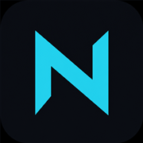

#  Nexora

**The platform that revolutionizes how Discord bots are built** — open-source TypeScript, production-ready from minute one.

Nexora isn’t another bot template — **it’s the platform Discord developers have been missing.** CLI, Studio (Developer OS), plugins, and auto-discovery in one coherent stack so you never scaffold a Discord bot from scratch again.

[](https://github.com/ogcjay/nexorats/actions/workflows/ci.yml)
[](https://cjays-organization.gitbook.io/nexora.ts)
[](./LICENSE)
[](https://nodejs.org)
[](https://pnpm.io)

> **Status:** early preview (`0.1.1`). APIs may change before `1.0.0`.
>
> **Documentation:** [https://cjays-organization.gitbook.io/nexora.ts](https://cjays-organization.gitbook.io/nexora.ts)  
> **Nexora Studio (local):** `http://localhost:3002` — Developer Center for *your* running project

<p align="center">
  
</p>

---

## Vision

Nexora exists to **revolutionize Discord bot development** — not as another starter kit, but as the shared platform the scene has been missing.

You get a production-ready bot stack in minutes: scaffold, auto-discovery, plugins, Studio, logging, and optional auth/database/API. The community grows it into a platform.

- **Free to use** under MIT
- **Free to extend** — build plugins, API routes, and services
- **Free to improve** — PRs and issues welcome
- **Community-driven** — a growing plugin ecosystem around one shared foundation

## Nexora vs a typical DIY bot stack

| Feature | From-scratch Discord project | Nexora |
| --- | :---: | :---: |
| Discord API compatibility | ✅ (you wire it) | ✅ |
| Project CLI / scaffold | ❌ / copy-paste | ✅ |
| Local Developer Center (Studio) | ❌ | ✅ |
| Plugin system | DIY | ✅ |
| Auto-discovery (commands / events) | DIY | ✅ |
| Typed `defineConfig()` | DIY | ✅ |
| Structured logging + startup banner | DIY | ✅ |

## Why Nexora?

| Building block        | What you get                                     |
| --------------------- | ------------------------------------------------ |
| **CLI**               | `@nexora.ts/create` scaffolds a full project     |
| **Studio**            | Local Developer Center (`localhost:3002`)        |
| **Commands & events** | `command()` / `event()` with auto-discovery      |
| **Plugin system**     | Commands, events, API, migrations                |
| **Auth**              | Discord OAuth, sessions, permissions             |
| **Database**          | Drizzle + repository layer (PostgreSQL / SQLite) |
| **API + WebSocket**   | Internal REST API and live events                |
| **Config & logging**  | Type-safe `defineConfig()`, structured logs      |

## Quick Start

```bash
npx @nexora.ts/create my-bot
cd my-bot
pnpm install
cp .env.example .env   # add your Discord token
pnpm dev
```

Open **http://localhost:3002** for Nexora Studio.

<p align="center">
  
</p>

### Minimal bot

```ts
import { command, event } from '@nexora.ts/core';
import { defineConfig } from '@nexora.ts/config';

export default defineConfig({
  bot: {
    token: process.env.DISCORD_TOKEN!,
    clientId: process.env.DISCORD_CLIENT_ID!,
  },
  database: {
    provider: 'postgresql',
    url: process.env.DATABASE_URL!,
  },
});

// commands/ping.ts
export default command({
  name: 'ping',
  description: 'Ping command',
  execute(ctx) {
    return ctx.interaction.reply('Pong!');
  },
});

// events/ready.ts
export default event('ready', (client) => {
  console.log(`Logged in as ${client.user.tag}`);
});
```

Commands and events are **auto-discovered** — no manual registration.

## Nexora Studio (local Developer Center)

When you develop a bot, **Nexora Studio** starts with `createDevServer` / `pnpm dev`. It is a local control panel — not the public docs site.

```text
Nexora Studio     http://localhost:3002   (embedded UI via @nexora.ts/dev-server)
Studio API        http://127.0.0.1:3920
```

Studio shows **project-specific** data: registered commands, events, plugins, sanitized config, database status, and live logs.

```bash
pnpm dev                               # bot + Studio API + embedded Studio UI
# monorepo optional Vite UI:
pnpm studio:dev
```

See the docs guide: [Nexora Studio](https://cjays-organization.gitbook.io/nexora.ts/platform/nexora-studio).

## Build plugins, grow the ecosystem

Plugins are first-class. A plugin can register commands, events, API endpoints, migrations, and services — without changing core.

```bash
nexora add tickets      # planned
nexora add moderation   # planned
```

Want to contribute a plugin or improve the framework? See [CONTRIBUTING.md](./CONTRIBUTING.md).

## Monorepo Structure

```
apps/
  docs/           Public VitePress / GitBook docs
  studio/         Nexora Studio (local Developer Center)
  playground/     Demo bot + Studio API
  dashboard/      Internal / experimental admin UI (not part of public docs)
packages/
  core/           Client, commands, events, DI, cache, scheduler
  config/         defineConfig() + validation
  logger/         Console, file rotation, live stream
  database/       Drizzle + repositories
  auth/           Discord OAuth & permissions
  api/            Internal REST API
  plugin-system/  Plugin API & lifecycle
  websocket/      Live events
  ui/             Shared UI primitives (internal)
  dev-server/     Introspection API for Studio
  cli/            create-nexora-ts + nexora
examples/
templates/
```

## Development (this repository)

**Requirements:** Node.js ≥ 20, pnpm 9.15+

```bash
git clone https://github.com/ogcjay/nexorats.git
cd nexorats
pnpm install
pnpm build
pnpm dev
```

| Command                             | Description                                      |
| ----------------------------------- | ------------------------------------------------ |
| `pnpm build`                        | Build all packages and apps                      |
| `pnpm dev`                          | Start apps (docs / studio / playground)          |
| `pnpm studio:dev`                   | Nexora Studio UI (`localhost:3002`)              |
| `pnpm docs:dev`                     | Preview public docs locally (optional)           |
| `pnpm docs:build`                   | Static docs build (same as CI → GitHub Pages)    |
| `pnpm typecheck`                    | TypeScript checks                                |
| `pnpm format` / `pnpm format:check` | Prettier                                         |

> Use **`pnpm`**, not `npm` / `npx pnpm` in this repo.

Publishing checklist: [PUBLISHING.md](./PUBLISHING.md) (GitHub) · [NPM_PUBLISH.md](./NPM_PUBLISH.md) (npm)

## Architecture Principles

- SOLID + Clean Architecture
- Dependency Injection via per-instance `Container` (no global singletons)
- Repository pattern for all DB access
- Studio and APIs talk through the internal API surface
- Plugins extend the platform without modifying core

## Community & Contributing

Nexora thrives when developers:

1. **Use** it for real bots
2. **Extend** it with plugins
3. **Improve** core, docs, and DX
4. **Share** patterns with the community

- Contribute: [CONTRIBUTING.md](./CONTRIBUTING.md)
- Community: [COMMUNITY.md](./COMMUNITY.md)
- Code of Conduct: [CODE_OF_CONDUCT.md](./CODE_OF_CONDUCT.md)
- Security: [SECURITY.md](./SECURITY.md)

## Roadmap (high level)

- [ ] Plugin install CLI (`nexora add <plugin>`)
- [ ] Redis cache adapter
- [ ] Official example plugins (tickets, moderation)
- [ ] Community plugin guidelines + showcase
- [ ] Stable `1.0.0` API

## License

[MIT](./LICENSE) © Nexora Contributors — free to use, modify, and distribute.
