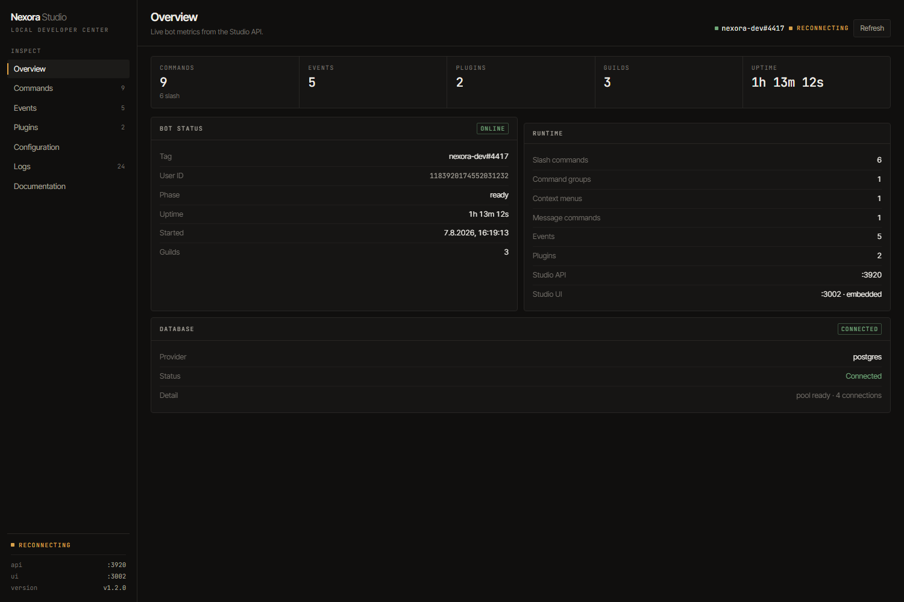
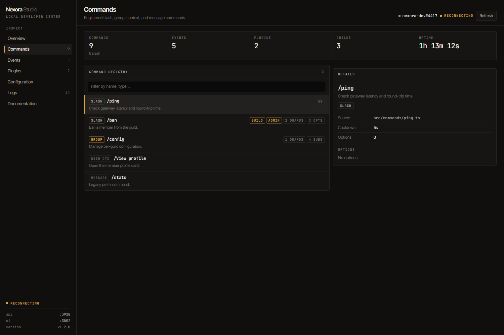
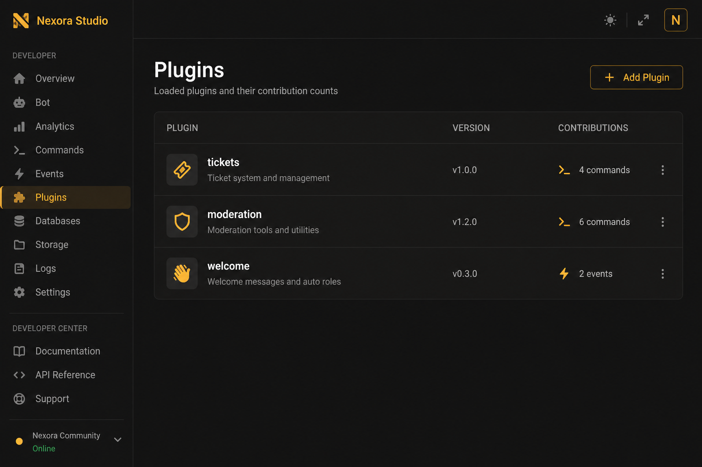

# Nexora Studio

**Nexora isn’t just a framework — it ships with a local Developer Operating System.**

**Nexora Studio** runs on `localhost:3002` next to your bot. It is the strongest day-one differentiator: live insight into *your* process — not a generic docs page.



It is **not** the public documentation website.

| | Public docs | Nexora Studio |
| --- | --- | --- |
| Where | [GitBook](https://cjays-organization.gitbook.io/nexora.ts) | `localhost:3002` |
| Audience | Everyone | You, on your machine |
| Content | Framework guides | **Your** commands, plugins, logs, config |
| Start | Open the URL | `pnpm dev` (embedded UI via `@nexora.ts/dev-server`) |

## Developer OS

Studio is evolving into a full **Developer OS** for the bot you are running — one surface for:

| Capability | Role |
| --- | --- |
| **Live Events** | Inspect Discord listeners attached to this process |
| **Commands** | Browse the live command tree (slash, groups, context, message) |
| **API** | Explore internal API routes as they roll out |
| **Database** | Inspect connections and data (viewer rolling out) |
| **Config** | Sanitized runtime config — secrets redacted |
| **Performance** | Analyzer for hot paths and latency (rolling out) |
| **Plugin Graph** | Loaded plugins, contributions, dependency health |
| **Errors & Metrics** | Logs, uptime, and process health |

What you can open today in Studio (Overview, Commands, Events, Plugins, Configuration, Logs) is already useful for day-to-day debugging. The broader OS map — and what ships in which phase — is documented in [Studio roadmap](studio-roadmap.md).

## Scaffold includes Studio

Projects from `create-nexora-ts@latest` wire `@nexora.ts/dev-server` so **both** the Studio API and an embedded Studio UI start with the bot. After `cp .env.example .env` and `pnpm install`:

```bash
pnpm dev
```

Open **http://localhost:3002** — no second terminal required.

Optional: `nexora dev` does the same as `pnpm run dev` and, when `@nexora.ts/studio` is available, prefers the Vite UI. The scaffold does not put `nexora` on PATH by itself — see [how to enable the `nexora` CLI](../packages/cli.md#nexora-cli-optional).

## Why Studio exists

A public docs site can never know:

- how many commands **your** bot registered
- which plugins **you** installed
- whether **your** database is connected
- live logs from **this** process

Studio shows exactly that.






## Ports

| Service | URL |
| --- | --- |
| **Nexora Studio** | http://localhost:3002 |
| Studio API | http://127.0.0.1:3920 |

## Wire it in your bot

```ts
import { createDevServer } from '@nexora.ts/dev-server';

const studioApi = createDevServer(bot, { port: 3920, studioPort: 3002 });
await studioApi.start();

// after plugins load:
studioApi.setPlugins(/* … */);
```

CLI helpers (after installing `@nexora.ts/create` globally, as a devDependency, or via `npx -p @nexora.ts/create …`):

```bash
nexora dev      # bot + Studio (Vite UI if available, else embedded)
nexora studio    # Vite Studio UI only (expects API on :3920)
nexora add <pkg>  # install a plugin from npm
nexora list       # local ./plugins + matching deps
```

Most users can stay on `pnpm dev` — Studio is already embedded.

In the monorepo:

```bash
pnpm --filter @nexora.ts/studio dev
```

## Available in Studio

Surfaces you can use when the bot is running with `createDevServer`:

- Bot status & uptime
- Command Explorer (registry + live metrics)
- Event Inspector (live handler tree + timing) and registered listeners
- Middleware Pipeline Viewer
- Performance Analyzer
- Dependency graph & dependency health
- Plugin list, local npm install, and deps health
- API Explorer and read-only Database viewer (when wired)
- Live Config (allowlisted hot patch) + sanitized raw config
- Log buffer
- Link to public docs
- Embedded UI served by `@nexora.ts/dev-server` (no separate Vite process required)

Full phase map: [Studio roadmap](studio-roadmap.md).

Plugin packages can also be installed from the CLI:

```bash
nexora add @scope/nexora-plugin-example
nexora remove @scope/nexora-plugin-example
nexora list
```

Then register them with `@nexora.ts/plugin-system` — see [Plugins](plugins.md).
